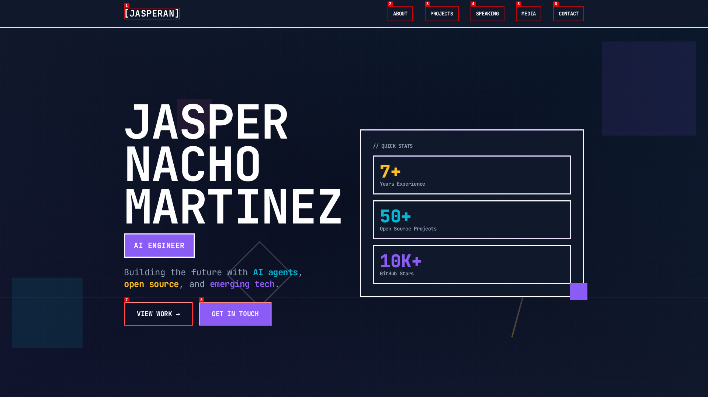

# Introduction

Welcome to my GitHub Page 👀

> 🌐 **[Click to visit my portfolio →](https://jasperan.github.io)**

I'm an AI Engineer with a specialization on emerging AI technologies. If you're interested in my content, check out the following links. 7 years of experience. I love teaching people about agents, vibecoding, opensource, inferencing, agentic AI, and ML in unique ways that make people learn better.

I also develop Open-Source Intelligence (CyberSec) tools sometimes in my free time, check out my best repositories below ⬇️

Follow me if you like Artificial Intelligence, Gaming and cool projects. I promise, everything I do goes opensource.

## 🎓 Courses

- [Agent Memory: Building Memory-Aware Agents](https://www.deeplearning.ai/short-courses/agent-memory-building-memory-aware-agents/) *(DeepLearning.AI x Oracle, 2026)* — Co-instructor with Richmond Alake. Build persistent memory systems for AI agents using Oracle AI Database, LangChain, and LLM-powered pipelines.

    > [Richmond Alake](https://github.com/richmondalake), Brendan Brown, [Andrew Ng](https://github.com/andrewyng) and I, San Francisco, 2026

## 🏆 My Stats

## ☕ Get In Touch

## ⭐ My Popular Repositories

## 🚀 What I'm Working On

### Notable Repos (Pre-2026)

### My Gaming ML Content (3 self-paced workshops)

- [League of Legends Machine Learning with OCI - Data Extraction](https://oracle-devrel.github.io/leagueoflegends-optimizer/hols/workshops/dataextraction/index.html) - About Data Extraction & Engineering!
- [League of Legends Machine Learning with OCI - Model Building with scikit-learn and AutoGluon](https://oracle-devrel.github.io/leagueoflegends-optimizer/hols/workshops/mlwithoci/index.html) - Illustrates the whole AI process once we have data available
- [League of Legends Machine Learning with OCI - Introduction to Neural Networks](https://oracle-devrel.github.io/leagueoflegends-optimizer/hols/workshops/nn/index.html) - A very basic introduction to all Neural Network concepts, like learning rate, backpropagation... etc.

#### AI + Gaming Articles

- [League of Legends Optimizer using Oracle Cloud Infrastructure: Data Extraction & Processing](https://github.com/oracle-devrel/leagueoflegends-optimizer/blob/main/articles/article1.md)
- [League of Legends Optimizer using Oracle Cloud Infrastructure: Data Extraction & Processing 2](https://github.com/oracle-devrel/leagueoflegends-optimizer/blob/main/articles/article2.md)
- [League of Legends Optimizer using Oracle Cloud Infrastructure: Building an Adversarial League of Legends AI Model](https://github.com/oracle-devrel/leagueoflegends-optimizer/blob/main/articles/article3.md)
- [League of Legends Optimizer using Oracle Cloud Infrastructure: Real-Time predictions](https://github.com/oracle-devrel/leagueoflegends-optimizer/blob/main/articles/article4.md)
- [League of Legends Optimizer using Oracle Cloud Infrastructure: Real-Time predictions 2](https://github.com/oracle-devrel/leagueoflegends-optimizer/blob/main/articles/article5.md)

### My Formula 1 + RedBull Content

- [Oracle RedBull Pit Strategy Hands-on Lab](https://oracle-devrel.github.io/redbull-pit-strategy/hols/workshops/pitstrategy/index.html)
- [Oracle x RedBull AI conference](https://github.com/oracle-devrel/redbull-analytics-hol)
- [Connecting F1 2021 Telemetry with Oracle JET](https://medium.com/oracledevs/connecting-f1-2021-telemetry-with-oracle-jet-a73714768c34)

### My Computer Vision (Health ML) Content

- [Creating a CMask Detection Model on OCI with YOLOv5: Data Labeling with RoboFlow](https://medium.com/oracledevs/creating-a-cmask-detection-model-on-oci-with-yolov5-data-labeling-with-roboflow-5cff89cf9b0b)

- [Creating a Mask Model on OCI with YOLOv5: Training and Real-Time Inference](https://medium.com/oracledevs/creating-a-mask-model-on-oci-with-yolov5-training-and-real-time-inference-3534c7f9eb21)

- [YOLOv5 and OCI: Implementing Custom PyTorch Code From Scratch](https://medium.com/oracledevs/yolov5-and-oci-implementing-custom-pytorch-code-from-scratch-7c6b82b0b6b1)

### My General ML Content

- [Benchmarking TensorFlow on OCI](https://medium.com/oracledevs/benchmarking-tensorflow-on-oci-70c781287b7d)
- [Benchmarking PyTorch on OCI and EfficientNet Models](https://medium.com/oracledevs/benchmarking-pytorch-on-oci-and-efficientnet-models-1d729b45d503)
- [Working with Data in TensorFlow](https://medium.com/oracledevs/working-with-data-in-tensorflow-a0656f616f4f)
- [Working with Data in PyTorch](https://medium.com/oracledevs/working-with-data-in-pytorch-fa2641e37d17)
- [Getting Started with PyTorch on OCI](https://medium.com/oracledevs/getting-started-with-pytorch-on-oci-dbaa5e7a40ef)

### My AI & Agents Content

- [The Great AI Context Debate: Why "Filesystem vs Database" Is the Wrong Question](https://medium.com/oracledevs/the-great-ai-context-debate-why-filesystem-vs-database-is-the-wrong-question-3454e27c27f6)
- [Build a Scalable Multi Agent RAG system with A2A Protocol and LangChain](https://medium.com/oracledevs/build-a-scalable-multi-agent-rag-system-with-a2a-protocol-and-langchain-0ac0255976f1)

### Articles in which I'm Featured

- [Team up with Red Bull Racing Honda and Oracle for Hands-on Lab teaching machine learning with racing data](https://medium.com/oracledevs/team-up-with-red-bull-racing-honda-and-oracle-for-hands-on-lab-teaching-machine-learning-with-70eafcf78383)
- [The Great AI Context Debate: Why "Filesystem vs Database" Is the Wrong Question](https://medium.com/oracledevs/the-great-ai-context-debate-why-filesystem-vs-database-is-the-wrong-question-3454e27c27f6)
- [Build a Scalable Multi Agent RAG system with A2A Protocol and LangChain](https://medium.com/oracledevs/build-a-scalable-multi-agent-rag-system-with-a2a-protocol-and-langchain-0ac0255976f1)

### My Public Appearances

    > Me @ Oracle CloudWorld 2022, Las Vegas
    
- Oracle CloudWorld, Las Vegas, Nevada, 2022, 2023, 2024
- DevLive Tour London, March 2024
- Kubecon Paris, March 2024
- Kubecon Salt Lake City, Utah, November 2024
- Oracle CloudWorld Tour Madrid, March 2025
- DevLive Tour Berlin, May 2025
- Kubecon Atlanta, Georgia, November 2025 (Agent2Agent Protocol Integration in a Multi-Agent RAG System​)
- AICamp San Francisco, California, February 2026 - Memory Engineering
- DevWeek San Jose, California, February 2026 - [Building the Brain and Backbone of Enterprise Agents](https://github.com/oracle-devrel/oracle-ai-developer-hub/blob/main/guides/brain_backbone_enterprise_agents_devweek_sf_2026.pdf)

## YouTube Videos

- [AI Webinar with Oracle (Ep 8) – MongoDB to Oracle – Switch and Use AI on your data and App](https://www.youtube.com/watch?v=9fWMl70HYPQ) *(AICamp, Sep 2025)*
- [Cloud Coaching – Java meets Generative AI](https://www.youtube.com/watch?v=cn09bvgxcIY) *(Oracle Developers, Jun 2024)*
- [Ep5 T3 – con Nacho Martínez sobre IA con Oracle](https://www.youtube.com/watch?v=cypL1LBQBUU) *(T3 Spanish Podcast, Mar 2024)*
- [Exploring the Power of AI with Nacho Martinez from Oracle Corporation](https://www.youtube.com/watch?v=lIceAEjkzUs) *(Tech With Nanor, Mar 2023)*
- [NetworkChuck - You NEED to learn Machine Learning, RIGHT NOW!!](https://www.youtube.com/watch?v=JJCq21Dc-Us)
- [League of Legends Content Series Interview: Using ML with League of Legends (LoL)](https://youtu.be/zz3xaLI0uq8)
- [AlmaLinux Pi Day 2021](https://youtu.be/kGfwYqXxBfY)
- [Machine Learning on OCI for League of Legends- Data Extraction](https://youtu.be/ad0RkqB07vI)
- [Machine Learning on OCI for League of Legends - Model Building with scikit-learn and AutoGluon](https://youtu.be/5iIvkgcMvhM)
- [Machine Learning on OCI for League of Legends: Introduction to Neural Networks](https://youtu.be/Uuo3ZSexNU8)
- [Learn about Training Large Language Models in Oracle Cloud Infrastructure](https://youtu.be/Zj4GGbrEekQ)

⭐️ From [jasperan](https://github.com/jasperan)
